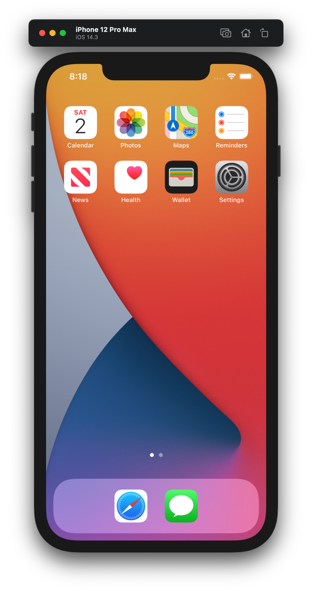

### How to take a screenshot and record a Video in iOS Simulator in Terminal



1. Open iOS Simulator
2. Open Terminal.app
3. Run below script to take a screenshot


```shell
xcrun simctl io booted screenshot 1r.png
```

4. Run below script to record a video and press CTRL + C to stop

```shell
xcrun simctl io booted recordVideo appPreview.mp4
```


### Additional commands

```shell
xcrun simctl list
xcrun simctl addmedia booted ~/Desktop/sample.png
xcrun simctl list | grep Booted # list booted simulators
xcrun simctl shutdown $UUID
xcrun simctl erase $UUID
pbcopy ~/Desktop/sample.txt
xcrun simctl pbpaste booted
xcrun simctl openurl booted "https://developer.apple.com"
```